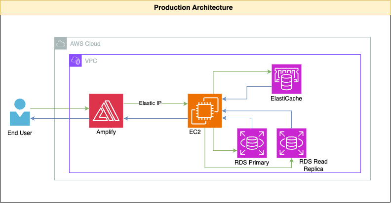
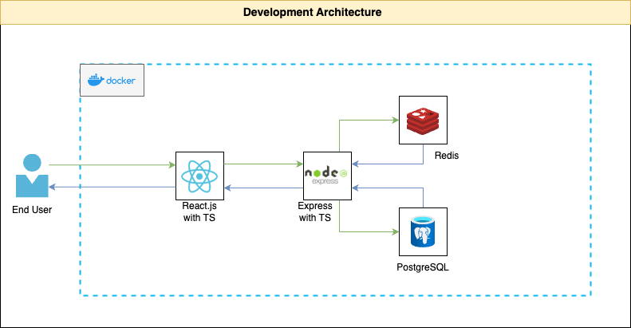

# Leaderboard






## 🚀 Installation

Before you begin, ensure you have the following installed:

- Docker
- Git  
- Node.js

### Setup Steps

1. Clone the repository

```bash

git clone https://github.com/fatihes1/leaderboard.git
cd leaderboard

```

2. Set up the environment variables

For Frontend (Client-Side):

```bash
cd client
cp .env.example .env
```

For Backend (Server-Side):

```bash
cd server
cp .env.example .env
```

And then, update the `.env` file with the required values.

3. Start Docker Container

```bash
docker compose up -d --build 
```
This command will start the following services:

- Frontend: http://localhost:3000
- Backend: http://localhost:8000
- PostgreSQL: localhost:5432
- Redis: localhost:6379

4. To stop the services, run:

```bash
docker compose down
```

## 📝 Endpoints

### Player Endpoints:

- **GET /player** - Get all players
- **PUT /player/{playerId}** - Increase the money of a player

Example Body:
```json
{
    "money": 100
}
```

### Leaderboard Endpoints:

- **GET /api/leaderboard** - Get the leaderboard
- **GET /api/leaderboard?playerId={playerId}** - Get first 100 players and the player with the given playerId with surrounding players
- **GET /api/leaderboard?playerName={playerName}** - Get suggested players with the given player name

